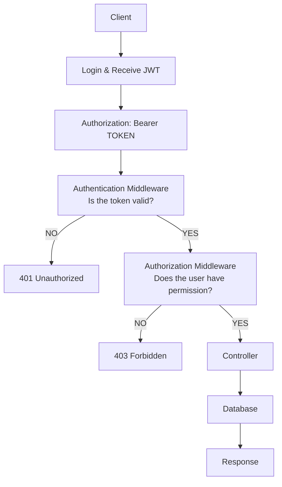
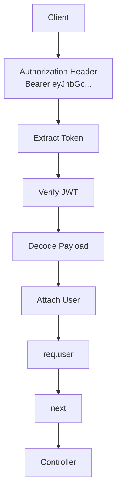
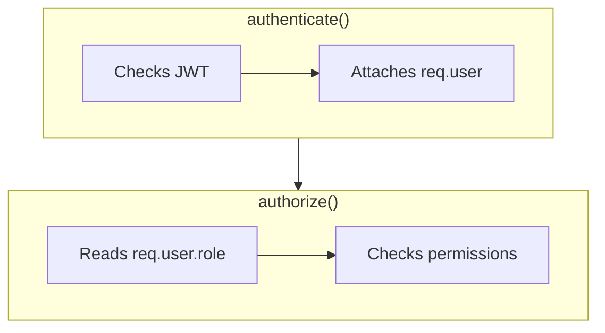

# Authentication & Authorization

## Learning Objectives

By the end of this lesson students should be able to:

- Explain Authentication vs Authorization
- Create Prisma Enums
- Add roles to the User model
- Set default user roles
- Include roles inside JWTs
- Decode JWTs using middleware
- Attach the logged-in user to the request
- Create reusable Authorization middleware
- Restrict endpoints based on roles
- Remove passwords from API responses
- Standardize API responses using a helper utility

## Authentication vs Authorization

- **Authentication** — who are you? Verified by validating the JWT sent in the `Authorization` header.
- **Authorization** — what are you allowed to do? Verified by checking the authenticated user's `role` against what an endpoint requires.

Authentication always happens first; authorization depends on its result.

## Request Lifecycle

## Authentication Middleware Flow

## authenticate() vs authorize()

## Implementation Steps

1. **Create Prisma Enums** — define a `Role` enum with `ADMIN` and `MEMBER` in `schema.prisma`.
2. **Add roles to the User model** — add a `role Role` field to `User`, defaulting to the least-privileged role (`@default(MEMBER)`).
3. **Run a migration** — `npx prisma migrate dev` to apply the schema change.
4. **Include roles inside JWTs** — when issuing a token on login/signup, embed `id` and `role` in the JWT payload.
5. **Decode JWTs using middleware** — an `authenticate` middleware extracts the token from the `Authorization` header, verifies it, and decodes the payload.
6. **Attach the logged-in user to the request** — the middleware sets `req.user` from the decoded payload so downstream handlers can read it.
7. **Create reusable Authorization middleware** — an `authorize(...roles)` middleware factory that checks `req.user.role` against an allowed list.
8. **Restrict endpoints based on roles** — apply `authenticate` then `authorize('ADMIN')` (or similar) to routes that need protection.
9. **Remove passwords from API responses** — strip the `password` field from any user object before sending it back to the client.
10. **Standardize API responses** — use a shared response helper so every endpoint returns a consistent `{ success, data, error }` shape.

## Notes

- The current `User` model (`prisma/schema.prisma`) does not yet have a `role` field — this is the first change to make.
- Middleware for `authenticate` / `authorize` should live alongside existing route handlers (`src/routes`) and be composed in front of protected endpoints.
- Roles for this feature are limited to two values: `ADMIN` and `MEMBER`. `MEMBER` is the default for new users.

## Status

This doc describes the planned implementation. Once the code is written and tested, this doc will be updated to reflect the actual changes made (final enum/field names, middleware locations, route protections, etc.).
